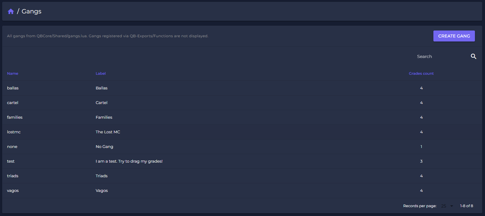
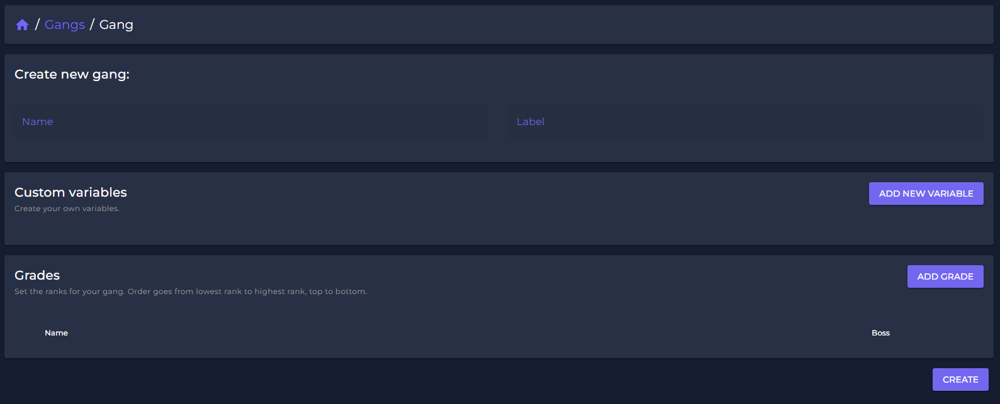
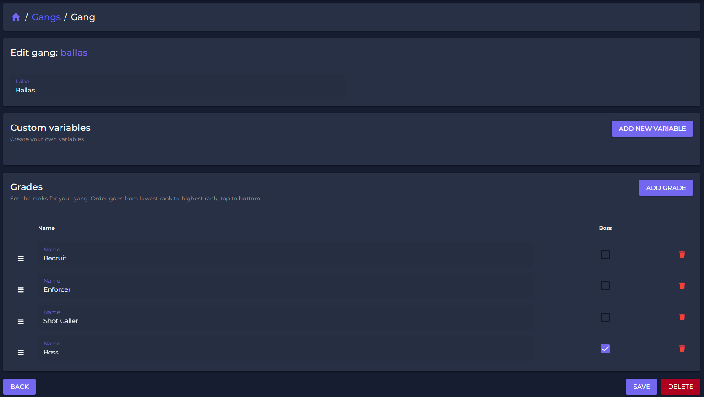
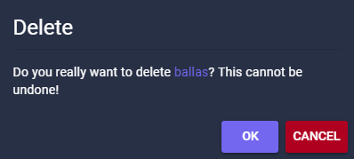

# 🥷 Gangs

## How to manage Gangs

After you set up your Webpanel, just click on "Gangs" in the list.\
You will get access to a list of all your active gangs, showing several usefull information like the amount of grades and the job-label. All information are editable.

<figure><figcaption></figcaption></figure>

## How to create a Gang

You can easy create a job by clicking "Create Gang"-button in the jobs-list.

<figure><figcaption></figcaption></figure>

After you created the gang, you can add all grades.\
By clicking "create" your gang is added live to your gameserver.

## Gang Settings

To open the specific gang settings, just click on the gang you like to edit.

<figure><figcaption></figcaption></figure>

Setting Gang variables allows you to add gang-specific actionpoints like dealers, shops or other accesspoints only the gang can use.&#x20;

With our Drag-and-Drop function you can drag the rank where it belongs. \
By clicking the "Boss"-button you set the boss rank to a grade. \
This status is limited to one grade only.&#x20;

## Delete a Gang

Select the gang you like to delete and simply click "DELETE".

The gang and all its grades will be removed and deleted!\
\
**Beware:** Since you do the changes live on your server, deleting a job might can cause some troubles. If you delete a stash you might delete items of players.

<figure><figcaption></figcaption></figure>

