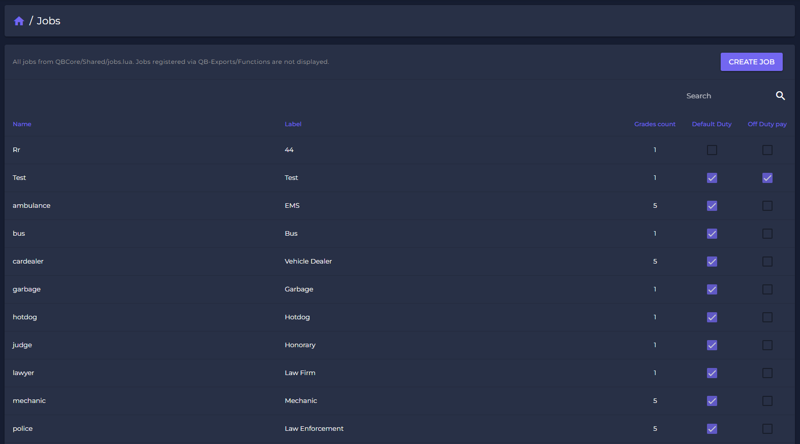
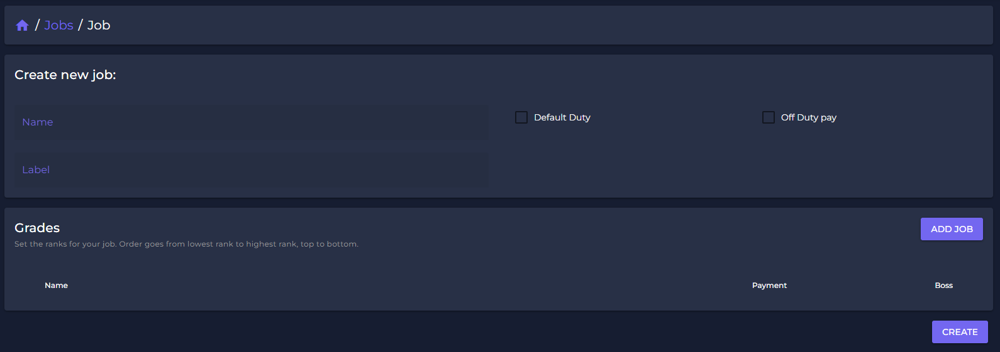
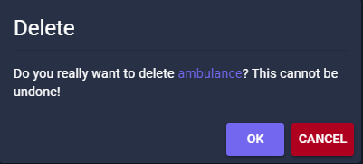

# 🗃 Jobs

To create a job in FiveM it is normally neccessary to have root-access and some development knowledge. You always need to restart your job-script after you edited the config files.

This belongs belongs to the past from now on!

With **Spectre** you gain the ability to manage your jobs like never before and in the most easiest way. Editing a job will also be synchronized LIVE with your gameserver! You don't need to restart any job-connected script anymore!

## How to manage Jobs

After you set up your Webpanel, just click on "Jobs" in the list.\
You will get access to a list of all your active jobs, showing several usefull information like the amount of grades and the job-label. All information are editable.

<figure><figcaption>
Job List (sample)
</figcaption></figure>

## How to create a Job

You can easy create a job by clicking "Create Job"-button in the jobs-list.\
The job creation focussed on the most important components of a job: name and label.

<figure><figcaption></figcaption></figure>

After you created the job, you can add grades, set loans and specifiy duty options.\
By clicking "create" your job is added live to your gameserver.

## Job Settings

To open the specific job settings, just click on the job you like to edit.

<figure><figcaption></figcaption></figure>

With our Drag-and-Drop function you can drag the rank where it belongs. \
By clicking the "Boss"-button you set the boss rank to a grade. \
This status is limited to one grade only. \

## Delete a Job

Select the job you like to delete and simply click "DELETE".

The Job and all its grades will be removed and deleted!\
\
**Beware:** Since you do the changes live on your server, deleting a job might can cause some troubles. If you delete a stash or garage you might delete items or avoid access to cars.

<figure><figcaption>
Delete a job
</figcaption></figure>
