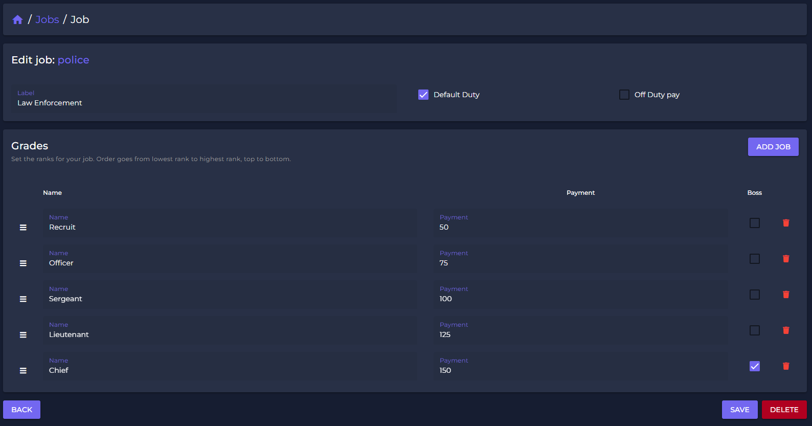

# 🗃 Jobs

To create a job in FiveM it is normally neccessary to have root-access and some development knowledge. You always need to restart your job-script after you edited the config files.

This belongs belongs to the past from now on!

With **Spectre** you gain the ability to manage your jobs like never before and in the most easiest way. Editing a job will also be synchronized LIVE with your gameserver! You don't need to restart any job-connected script anymore!

## How to manage Jobs

Navigate to the Development - Jobs section. You get a list of all jobs from your Shared/Jobs.lua file in `qb-core`. You will get access to a list of all your active jobs, showing several usefull information like the amount of grades and the job-label. All information are editable.&#x20;


Dynamicly registered jobs from any other script (e.g. job-creators) wont get displayed!


<figure><figcaption>
Job List (Sample)
</figcaption></figure>

## Adding/Edit Jobs

To manage or add an specific job, click on "Create Job" or choose an existing job from the list to get access on the job settings.&#x20;

<figure><figcaption>
Job options (Sample)
</figcaption></figure>

## Job Settings

To open the specific job settings, just click on the job you like to edit.

<figure><figcaption></figcaption></figure>

With our Drag-and-Drop function you can drag the rank where it belongs. \
By clicking the "Boss"-button you set the boss rank to a grade. \
This status is limited to one grade only. \

## Delete a Job

Select the job you like to delete and simply click "DELETE".

The Job and all its grades will be removed and deleted!\
\
**Beware:** Since you do the changes live on your server, deleting a job might can cause some troubles. If you delete a stash or garage you might delete items or avoid access to cars.

<figure><figcaption>
Delete a job
</figcaption></figure>
