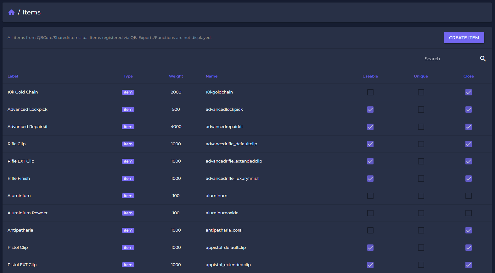
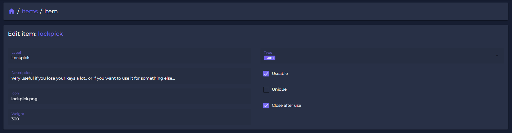
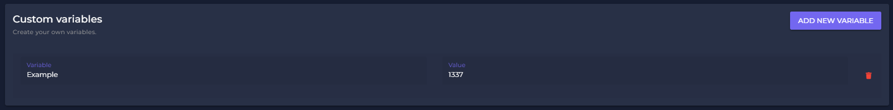
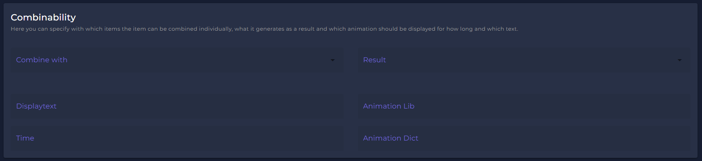
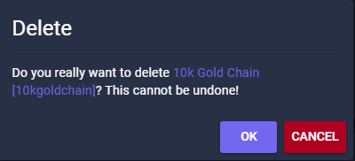

# 📦 Items

The **Unlimited Webpanel** offers users the unique possibiliy to create, change or delete item definitions of your server. All changes to the items will go live instantly!&#x20;

We focused on giving you the easiest and fastest way to develop items on your server. In combination with our beautiful layout, we created a tool everyone will be able to work with              - without needing any .lua-knowledge or root-access!&#x20;

## **How to manage items?**

Navigate to the Development - Items section. You get a list of all items from your Shared/Items.lua file in `qb-core`.


Dynamicly registered items from any other script (e.g. item-creators) wont get displayed!


<figure><figcaption>
Item List (Sample)
</figcaption></figure>

## Adding/Edit Items

To manage or add an specific item, click on "Create item" or choose an existing item from the list to get access on the item settings.&#x20;

<figure><figcaption>
Item options (Sample)
</figcaption></figure>

| Configurable Information                                                               | Configurable Functions                                            |
| -------------------------------------------------------------------------------------- | ----------------------------------------------------------------- |
| <ul><li>name</li><li>label</li><li>description</li><li>image*</li><li>weight</li></ul> | <ul><li>usable</li><li>unique</li><li>close after usage</li></ul> |

\*item-images need to be added seperatly or can be set by name if they exist already on your server.

## Custom Variables

We also provide the option to create custom variables. Supported datatypes are `String`, `Number` and `Boolean`. Spectre checks for duplicated keys and wont allow them. [Default keys](./#adding-items) are also protected.

<figure><figcaption>
Item custom variables (Sample)
</figcaption></figure>

## Adding Receipes

<figure><figcaption>
Item recipe (Sample)
</figcaption></figure>

You can also utilize the default QBCore crafting with custom texts, animation while crafting and crafting duration.

Press "SAVE" to synchronise your item-database and add the item to your server.

## Delete Items

If you want to delete a specific item, just search for it an select it. You will find a "DELETE"-button in the right buttom corner. This options requires the `Item:Edit` permission.\
\
After you clicked it, you need to confirm the removal. The item will be removed live from your Gameserver!\
\
**Beware:** Deleting an item can cause script-errors, if you delete an item which is neccessary for script performance. Example: If your remoce "Repair-Kits", mechanics might no longer be able to repair cars!

<figure><figcaption></figcaption></figure>

