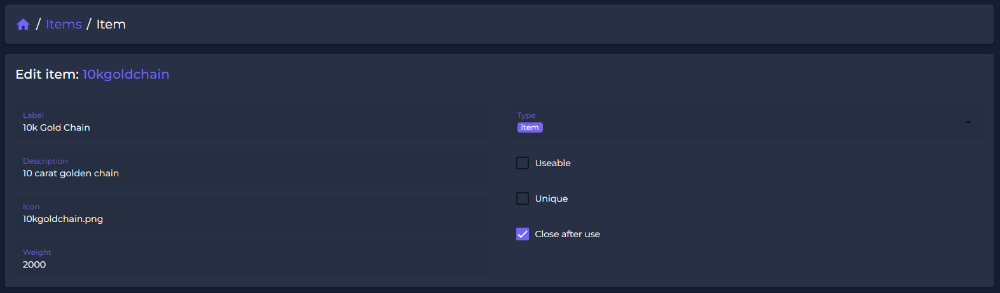

# 📦 Items

The **Unlimited Webpanel** offers users the unique possibiliy to create, change or delete items of your server. All changes to the items will go live instantly!&#x20;

We focused on giving you the easiest and fastest way to develop items on your server! In combination with our beautiful layout, we created a tool everyone will be able to work with              - without needing any .lua-knowledge or root-access!

## **How to manage items?**

The way to manage items is as easy as possible!\
After you set up your Webpanel, just click on "items" in the webpanel.\
You will get access to an item-list, showing all your recently added items.\
(This is a sample disclaimer and will look different, depending on your language and added server-items!)

## Item List

<figure><figcaption>
Item List (sample)
</figcaption></figure>

By seeing the items-overview you already succeed on your first step.\
The system is running and now you can go forward to manage your items!

## Adding Items

To manage or add an specific item, click on "Create item" or choose or search an existing item out of the list to get access on the item settings.

<figure><figcaption>
Item Settings
</figcaption></figure>

| Configurable Information                                                               | Configurable Functions                                            |
| -------------------------------------------------------------------------------------- | ----------------------------------------------------------------- |
| <ul><li>label</li><li>name</li><li>description</li><li>image*</li><li>weight</li></ul> | <ul><li>usable</li><li>unique</li><li>close after usage</li></ul> |

\*item-images need to be added seperatly or can be set by name if they exist already on your server.

## Adding Receipes

<figure><figcaption>
Item recipes
</figcaption></figure>

Since many servers using receipes to craft items, we decided to add a function to create to receipes in our webpanel. You can also add texts, animation while crafting and duration.

Press "SAVE" to synchronise your item-database and add the item to your server - LIVE!\

## Delete Items

If you want to delete a specific item, just search for it an select it.\
You will find a "DELETE"-button in the right buttom corner.\
\
After you clicked it, you need to confirm the removal. The item will be removed live from your Gameserver!\
\
**Beware:** Deleting an item can cause script-errors, if you delete a item which is neccessary for script performance. Example: If your remoce "Repair-Kits", mechanics might no longer be able to repair cars!

<figure><figcaption></figcaption></figure>
