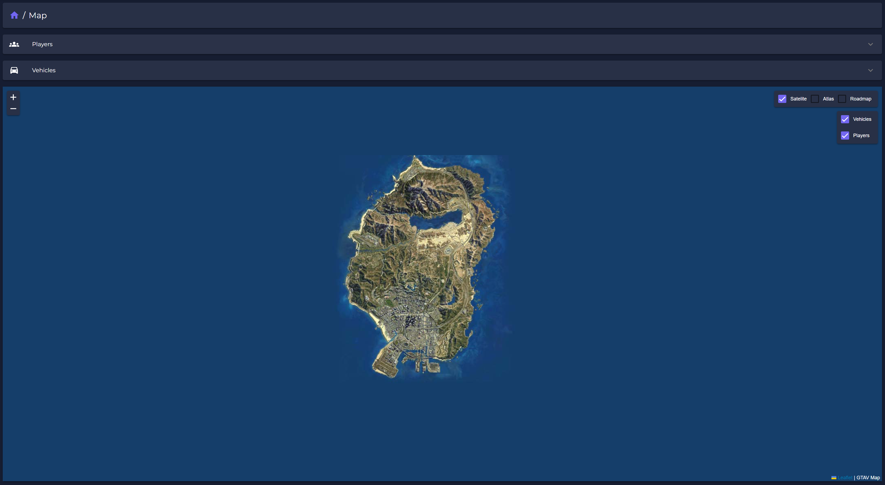
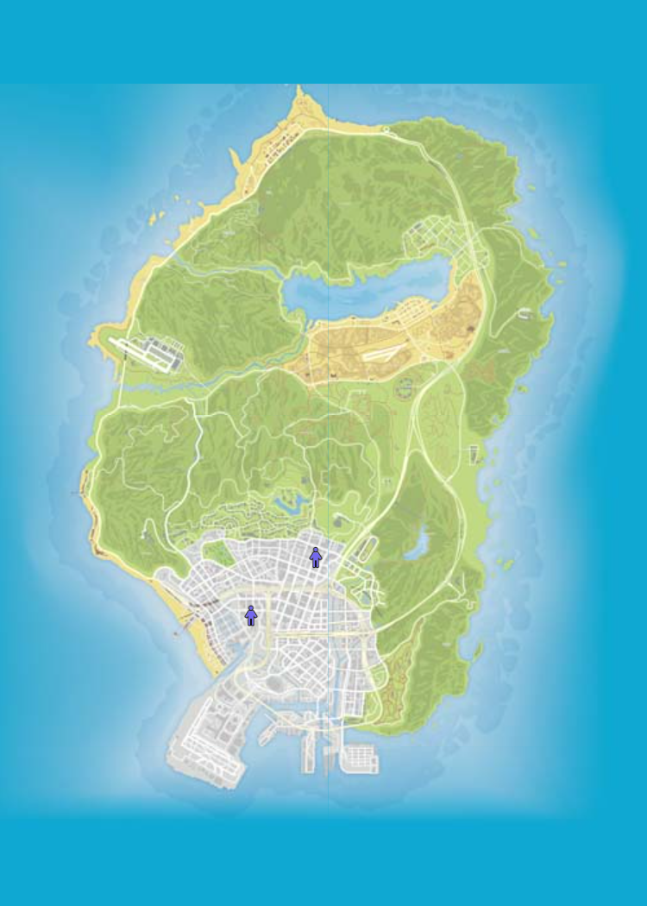
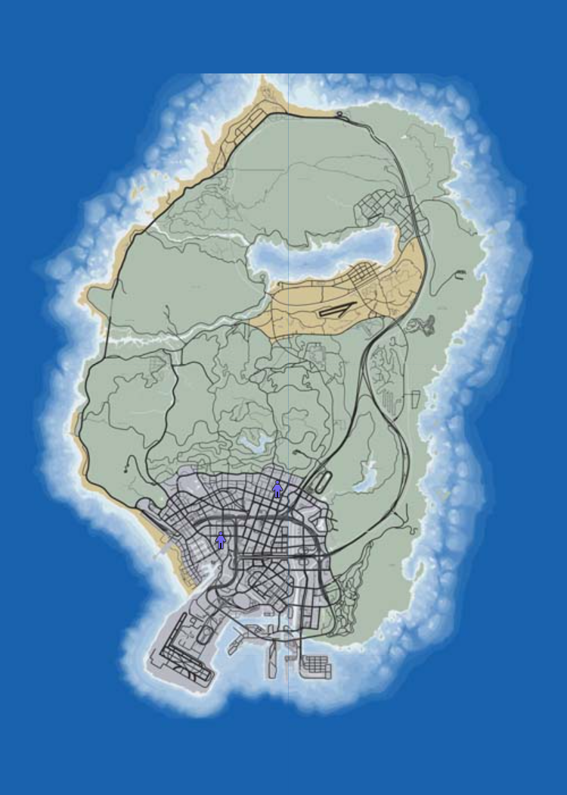
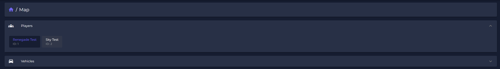
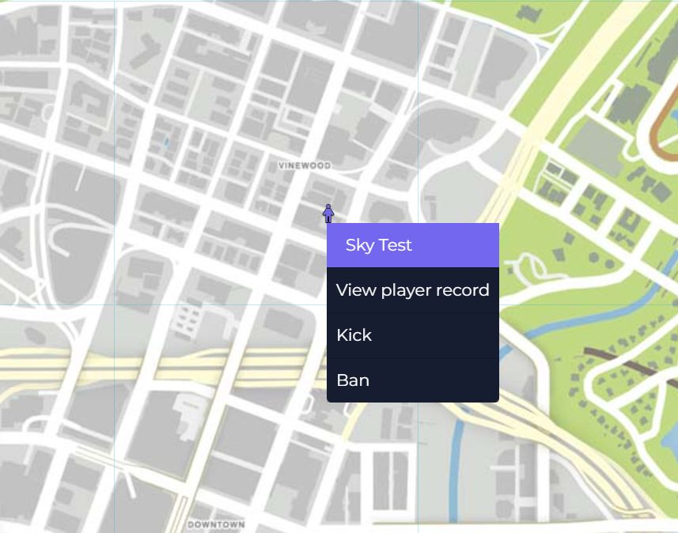

# 🗺 Live Map

## Features

The live-map is tracking all players and vehicles with their location LIVE, offering a very simple and unique way to manage and support your server.

<figure><figcaption>
Live-Map
</figcaption></figure>

Choose your favorite map-layout.&#x20;

<figure><figcaption>
Atlas
</figcaption></figure>

 

<figure><figcaption>
Roadmap
</figcaption></figure>

 

<figure><figcaption>
Saltelite
</figcaption></figure>

Quick player selection will zoom he view to the players location. (Same for vehicles!)

<figure><figcaption></figcaption></figure>

Right-clicking a player offers some additional quick-actions. (Same for vehicles!)

<figure><figcaption>
Player Options
</figcaption></figure>

