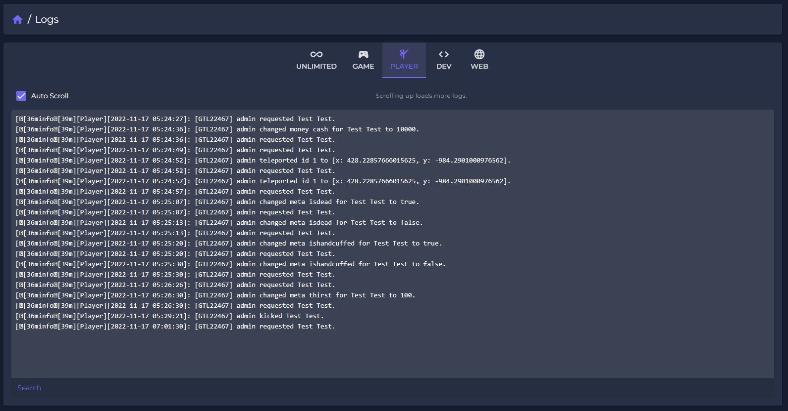

# 🗒 Logs

To integrade the Unlimited - Spectre logs to your scripts, \
use our server side exports:

```
Valid types: ['info', 'error', 'warn', 'debug']
 
exports['unlimited-spectre']:GameLog(type, message) 
exports['unlimited-spectre']:PlayerLog(citizenId, type, message)

```

In the "Logs" section you can select which logs you want to display. \
Logs-access can be managed in the role configurations.

<figure><figcaption></figcaption></figure>

You can currently choose between ALL, game-, player-, develoment- and weblogs to display them.

<figure><figcaption></figcaption></figure>
