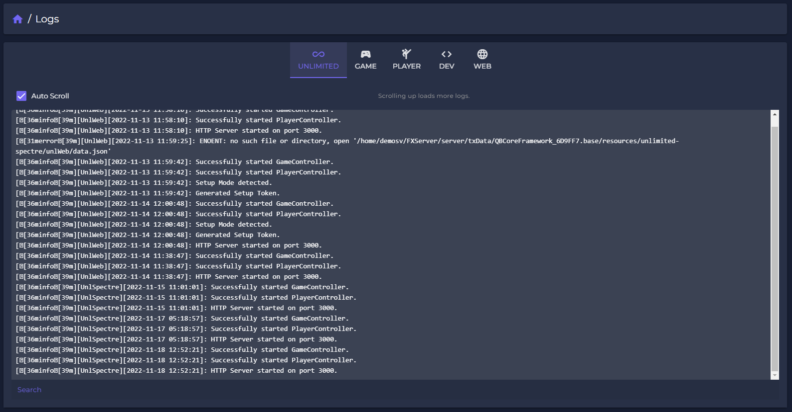

# 🗒 Logs

In the "Logs" section you can select which logs you want to display. Access can be managed in the role configurations via permissions.

<figure><figcaption></figcaption></figure>

You can currently choose between the following sections:

| Category  | Content                                                                                       | Permission       |
| --------- | --------------------------------------------------------------------------------------------- | ---------------- |
| Unlimited | Resource specific logs.                                                                       | Logs:Read        |
| Game      | All game related logs (e.g. player killed by) and [GameLog-Export](logs.md#integration) logs. | Logs:Game        |
| Player    | All actions on players. Some logs can be game and player logs at the same time.               | Logs:Player      |
| Dev       | All logs related to Development section of Spectre.                                           | Logs:Development |
| Web       | All web actions.                                                                              | Logs:Webpanel    |


## Integration

To integrade the Unlimited - Spectre logs to your scripts, use our server side exports:

```javascript
Valid types: ['info', 'error', 'warn', 'debug']
 
exports['unlimited-spectre']:GameLog(type, message) 
exports['unlimited-spectre']:PlayerLog(citizenId, type, message)

```

Player logs need the specific player identification (QBCore: citizenId) to get accepted and displayed in the player tab.\
