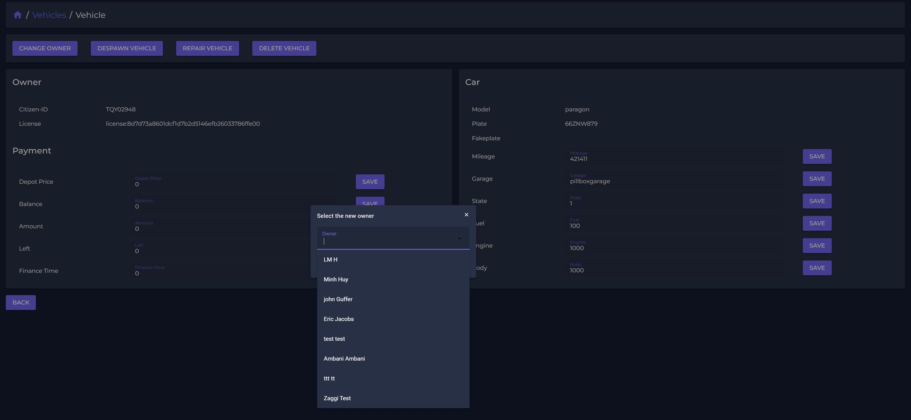
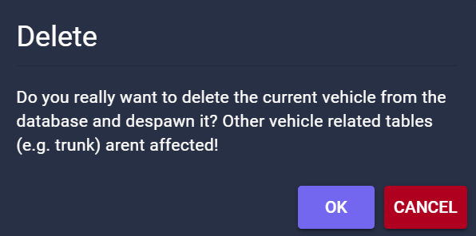

# 🚗 Vehicles

With our vehicle list you have an overview on all player-owned vehicles.\
Status of cars is displayed by the garage-status and most important vehicle information are listed.\
We added a search function for plate, model or owner-id.

<figure><figcaption></figcaption></figure>

By clicking a vehicle you get deeper into vehicle settings.\
Quick actions for vehicles enable supporting functions even if you are not connected to the gameserver.

<figure><figcaption></figcaption></figure>

Changing owner will transfer ownership to a selected player. \
A list of all registerd players is displayed and players can be searched.

<figure><figcaption></figcaption></figure>

The delete function will completely delete the vehicle from the gameserver.\
Before deleting a vehicle you have to confirm the action.

<figure><figcaption></figcaption></figure>
