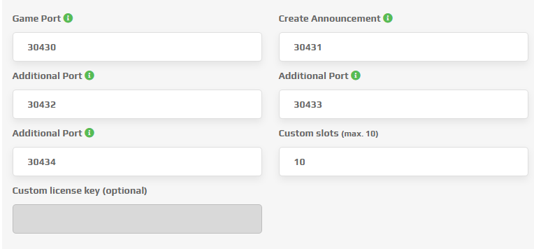
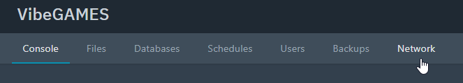
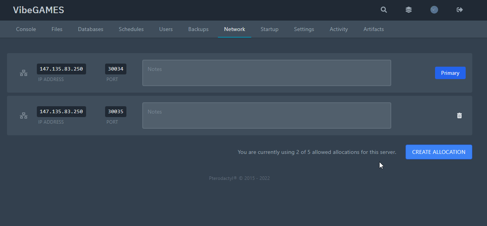

# 🎮 Gameservers

Mostly gameservers dont offer the additonal port, spectre needs. Check the following guides to use our webpanel on your gameserver.

## [ZAP-Hosting](https://zap-hosting.com/)

You need to navigate to your gameserver settings in the zap webpanel. At the bottom of the settings you will find following part.

<figure><figcaption><p>ZAP Gameserver settings (example)</p></figcaption></figure>

Check the "Additional Port" sections. Choose one free port.

Inside our `config.json` now adjust your settings:

```
"port": "30432"
```

Your webpanel is now accessable on your `http:://serverip:30432` (replace 30432 with your Additional Port).

## [Vibegames](https://vibegames.com/)

You need to add an extra port in your control panel.

In the control panel, click on Network.

<figure><figcaption><p>Navigate to network</p></figcaption></figure>

If you are allowed to add an extra port/allocation you can press <mark style="color:purple;">CREATE ALLOCATION</mark>.

<figure><figcaption><p>Create new allocation</p></figcaption></figure>

Inside our `config.json` now adjust your settings:

```
"port": "65348"
```

Your webpanel is now accessable on your `http:://serverip:65348` (replace 65348 with your new created allocation).

## General

We always offer the option, to run the webpanel on your FiveM Port. This option is often limited by your gameserver provider with Rating Limits (limiting requests).&#x20;

To use this option, you need to addjust your `externalHosting.js` file inside `unlimited-spectre/html/assets`

```
const e={backend:"/unlimited-spectre",base:"",webHistory:"/unlimited-spectre",isSubPath:"/unlimited-spectre",socketPath:"/unlimited-spectre/socket.io"};export{e};

```

Afterwards you can access your panel at:

`http://serverip:serverport/unlimited-spectre/`


Replace `ulimited-spectre with your resource name!`

