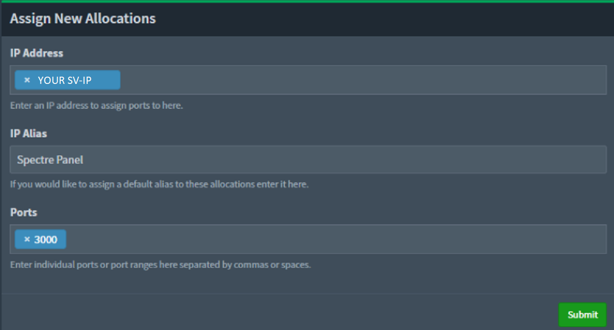
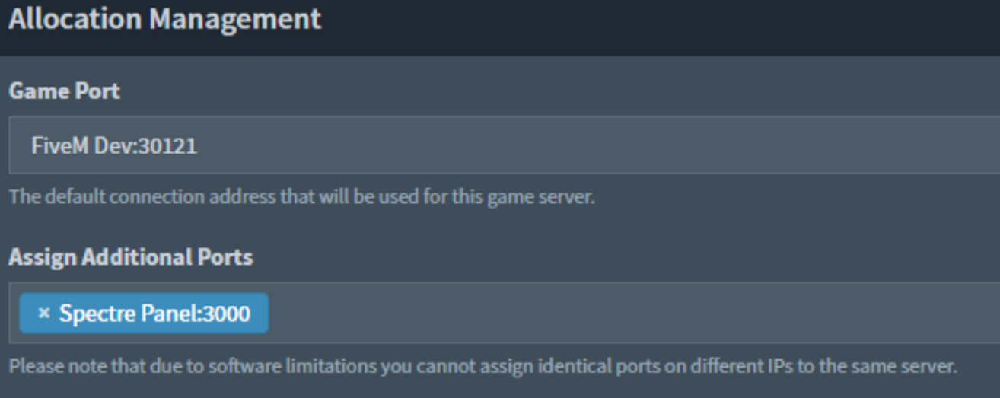

# 🦇 Pterodactyl

_by Peter#3261_

## Port

You will need setup port allocation first on the respective node for your FiveM server

<figure><figcaption>
Port allocation (Sample ip)
</figcaption></figure>

If you have modified your Spectre port you will need to ensure you put the respective port in the “Ports” section, once you’ve filled this in Submit this.

Next, navigate to your “Server” and under “Build Configuration”.

<figure><figcaption>
Assign port
</figcaption></figure>

You will want to select the Spectre Panel port as an assigned additional port, once added click update build configuration

Once you’ve done this you **MUST** restart the full docker server container.

.png>)

Once you restart the server you can continue on with the normal Spectre setup process and you will be able to visit <mark style="color:blue;">http://IP:PORT</mark>.\

## Reverse Proxy NGINX

First step make a new file in your /etc/nginx/sites-enabled folder.

<figure><figcaption>
NGINX folder
</figcaption></figure>

Once you have done this in the file you want to put the following.

<figure><figcaption>
NGINX conf file example
</figcaption></figure>

Once you have done this run - systemctl restart nginx from SSH terminal.

Then visit your subdomain and voila! You now have a basic nginx reverse proxy setup for spectre.
