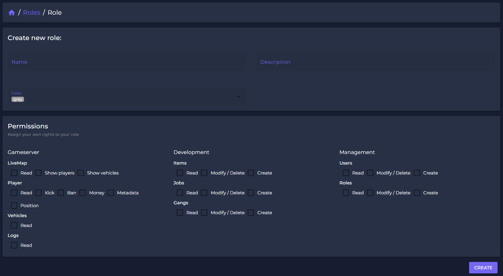
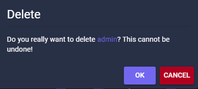

# 🔐 Roles

## How to manage Roles

To give your team access to Unlimited - Spectre, you need to give permissions to all users.\
Permissions can be assigned to users by creating a specific role which can be edited to the need of the users tasks.&#x20;

<figure><figcaption></figcaption></figure>

## How to create a Role

You can add an infinte amount of roles, granting each role specific permissons based on the tasks the role needs to fulfill.


Be carefull with granting permissions due to possible abuse!


<figure><figcaption></figcaption></figure>

## Role settings

Permissions are separated in three categories - Gameserver, Development & Management.

| Gameserver | Development | Management |
| ---------- | ----------- | ---------- |
| Live-Map   | Items       | Users      |
| Player     | Jobs        | Roles      |
| Vehicles   | Gangs       |            |
| Logs       |             |            |


Management-permissions should only be granted to admins.


<figure><figcaption></figcaption></figure>

## Delete a Role

Roles can be deleted by all users having permission for the management-functions.


By deleting a role, all users with this role will loose their permissions instantly.


<figure><figcaption></figcaption></figure>

