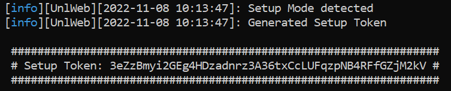

# 🛠 Setup

## Download resource

After your purchase you will recieve the resource via the FiveM Keymaster. Inside the section "Granted Assets" you will find an asset named \[QBCore] Unlimited.wtf - Spectre.

After placing the downloaded resource in your resource directory you can step through this list to get started.


**Always backup your QBCore Shared folder before using this resource! Spectre writes into the files "items.lua", "jobs.lua" and "gangs.lua".**



You can change the used port before launch with the convar\
`unlWebPort [port]`inside your server.cfg


1. Start the resource after `qb-core`.
2. If everything went right, you will see a setup token inside your console.
3. Visit the IP of your gameserver in your browser with port 3000 (e.g. 127.0.0.1:3000).
4. A setup screen welcomes you and will help you setting up everything.
5. After the language selection and creating the master user you will need to insert your setup token mentioned before.

<figure><figcaption>
Setup token
</figcaption></figure>

Thats it! Installation was successful if you can now log in. For the best experience also check our [Configuration](../get-started/configuration.md) tab (e.g. change used inventory).

For reinstall, you can stop the resource and delete the unlWeb folder inside the resource. After deleteing, you can start it again.

For help you can also create a ticket on our discord.
